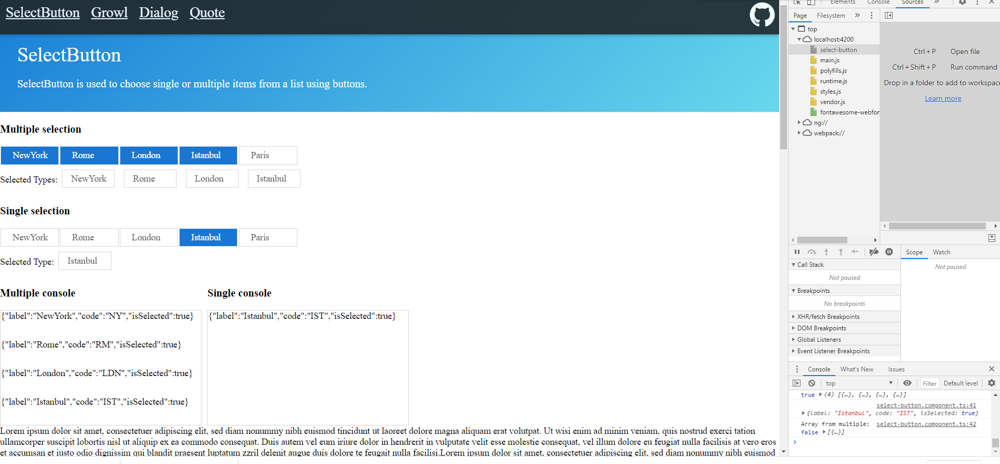
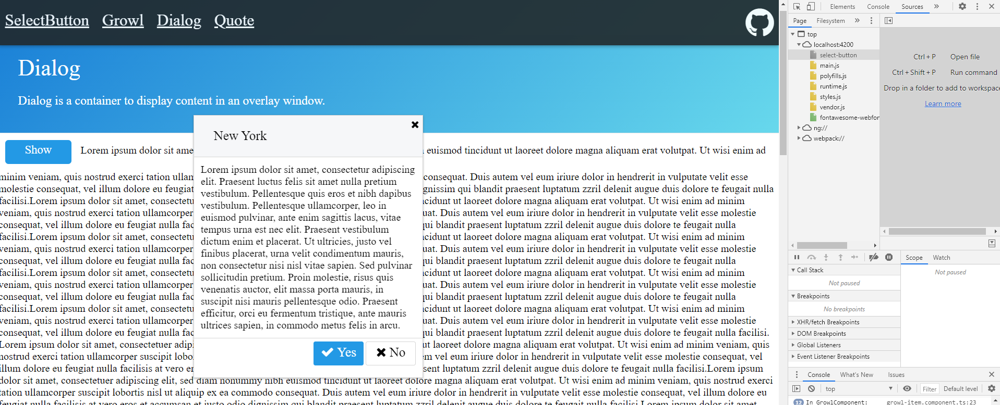
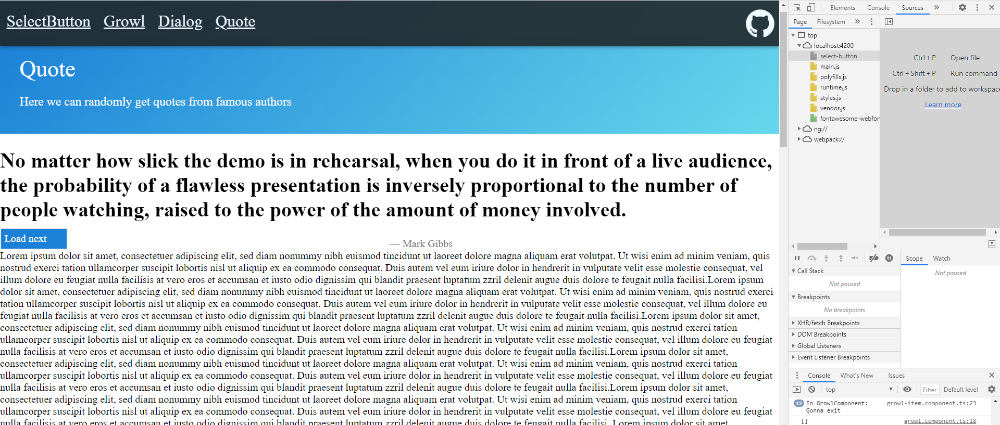

# AngularComponents
Graduation project of Netcracker Educational Center. Library of Angular components with showcases similar to PrimeNg.  

Consists of 4 components: 
1. Select button Component (multiple modes)    
SelectButton is a form component to choose a value from a list of options using button elements.

2. Growl Component    
Growl displays messages in an overlay.

3. Dialog Component   
An external page can be displayed in a dynamically generated dialog on runtime.

4. Quote Component   
Component which fetches and shows quote from http://quotes.stormconsultancy.co.uk

This project was generated with [Angular CLI](https://github.com/angular/angular-cli) version 6.0.8.

## Development server

Run `ng serve` for a dev server. Navigate to `http://localhost:4200/`. The app will automatically reload if you change any of the source files.

## Code scaffolding

Run `ng generate component component-name` to generate a new component. You can also use `ng generate directive|pipe|service|class|guard|interface|enum|module`.

## Build

Run `ng build` to build the project. The build artifacts will be stored in the `dist/` directory. Use the `--prod` flag for a production build.

## Running unit tests

Run `ng test` to execute the unit tests via [Karma](https://karma-runner.github.io).

## Running end-to-end tests

Run `ng e2e` to execute the end-to-end tests via [Protractor](http://www.protractortest.org/).

## Further help

To get more help on the Angular CLI use `ng help` or go check out the [Angular CLI README](https://github.com/angular/angular-cli/blob/master/README.md).
